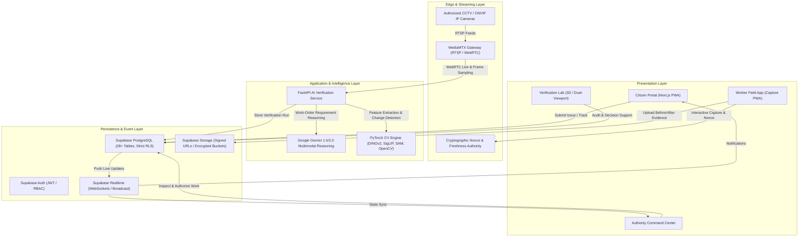

# GROUND0

<div align="center">

```
   ______ ____  ____  __  ___ _   __ ____   ____ 
  / ____// __ \/ __ \/ / / / // | / // __ \ / __ \
 / / __ / /_/ / / / / / / / //  |/ // / / // / / /
/ /_/ // _, _/ /_/ / /_/ / // /|  // /_/ // /_/ / 
\____//_/ |_|\____/\____/_//_/ |_//_____/ \____/  
```

### **AI-Powered Proof of Physical Work Platform**
*“Verify the Work. Reveal the Reality.”*

[](https://opensource.org/licenses/MIT)
[](https://www.typescriptlang.org/)
[](https://nextjs.org/)
[](https://fastapi.tiangolo.com/)
[](https://supabase.com/)
[](https://pytorch.org/)
[](https://github.com/bluenviron/mediamtx)

---

</div>

## 📌 Executive Summary

Every year, billions of dollars in public and enterprise funds are disbursed for civil repairs, road maintenance, waste management, and physical infrastructure. Yet municipalities and organizations struggle with a persistent, costly challenge: **the gap between claimed completion and physical reality**. 

Traditional systems rely on static photo uploads, unverified contractor self-reporting, or slow manual audits—vulnerable to recycled imagery, wrong-site submissions, and superficial repairs.

**Ground0** is the world's first unified **AI-Powered Proof of Physical Work Platform**. It establishes an unbroken chain of custody from citizen report to verified resolution:

```
CLAIMED COMPLETION ➔ DIGITAL EVIDENCE ➔ GROUND0 VERIFICATION ➔ HUMAN REVIEW ➔ VERIFIED RESOLUTION
```

Ground0 connects **Citizens**, **Authorities**, **Field Workers/Contractors**, and **Autonomous Verification Agents** into an integrated, tamper-evident physical audit ecosystem.

---

## 🏛️ System Architecture

Ground0 is engineered as an enterprise-grade monorepo combining edge media capture, high-throughput geospatial event streaming, deep computer vision, multimodal reasoning, and real-time human decision support.



---

## 🔄 Core Ground0 Workflow

1. **Citizen Issue Intake**: Citizens capture photographic/video proof of infrastructure defects (potholes, garbage accumulation, water leakages, drain blockages). Geolocation, timestamp, and optional voice descriptions are attached.
2. **AI Triage & Deduplication**: Gemini extracts structured parameters; the Deduplication Engine clusters nearby reports into **Master Issues** using geospatial radius and visual embedding similarity.
3. **Authority Work Order**: Municipal authorities triage the master issue, configure structured completion requirements (e.g. *defect coverage reduction > 90%*), and assign contractors with hard deadlines.
4. **Before-Work Cryptographic Session**: Field workers initiate a capture session receiving a time-bound server nonce, capturing signed "Before" evidence with sensor and GPS validation.
5. **Physical Execution**: Workers complete physical repairs on-site.
6. **After-Work Capture Challenge**: Workers submit multi-angle "After" evidence matching original viewpoints.
7. **Ground0 Multi-Stage Verification Pipeline**:
   - **Stage 1 (Integrity Check)**: SHA-256 hash match, perceptual hash (pHash), image replay check, media reuse prevention.
   - **Stage 2 (Geospatial Consistency)**: Haversine distance verification against target work-order coordinates with uncertainty tolerances.
   - **Stage 3 (Scene Identity)**: Deep visual feature alignment (DINOv2 / SigLIP / ORB homography) confirming that Before and After depict the *exact same physical location*.
   - **Stage 4 (Physical Change Detection)**: Semantic defect mask segmentation (garbage coverage %, asphalt continuity, surface plane reconstruction).
   - **Stage 5 (Requirement Satisfaction)**: Gemini parses technical contract mandates against visual changes.
   - **Stage 6 (Camera Cross-Reference)**: Corroboration via authorized municipal CCTV / ONVIF streams if available.
   - **Stage 7 (Risk Assessment Engine)**: Composite scoring yielding LOW, MEDIUM, or HIGH risk flags.
8. **Inspector Decision Support**: Official inspectors examine the Verification Lab's interactive split-screen slider, diff masks, and agent audit trails to approve, reject, or request physical inspection.
9. **Citizen Transparent Verification**: Citizens inspect Before ↔ After sliders on their device and confirm genuine resolution or request reopening.

---

## 🎨 Design System: "Royal Obsidian"

Ground0 delivers a luxurious, authoritative command center aesthetic designed for high-stress municipal operations:

- **Obsidian Black (`#08080A`)** & **Graphite (`#121316`)**: Deep, low-fatigue backdrop.
- **Champagne Gold (`#D4AF37`)**: Sovereign accents and primary high-value actions.
- **Deep Emerald (`#10B981`)**: Positive verification, cryptographic integrity, and resolution.
- **Platinum / Slate (`#E2E8F0`)**: Crisp, high-contrast typography and data visualization.
- **Amber Warning (`#F59E0B`)**: Discrepancies, distance warnings, and human review advisories.
- **Controlled Crimson (`#EF4444`)**: Replay attack detection, duplicate evidence, and severe violations.

---

## 📂 Monorepo Structure

```
ground0/
├── apps/
│   ├── web/                    # Next.js 15 App Router Frontend & PWA
│   │   ├── app/                # App router pages (/report, /verification-lab, etc.)
│   │   ├── components/         # Royal Obsidian components, 3D scenes, maps
│   │   └── lib/                # Supabase client, auth helpers, API clients
│   └── ai-service/             # FastAPI Computer Vision & Verification Engine
│       ├── routers/            # /integrity, /scene-match, /change-detect, /pipeline
│       ├── models/             # PyTorch inference wrappers (DINOv2, SigLIP, SAM)
│       └── services/           # Gemini client, feature extractors, spatial metrics
├── services/
│   └── media-gateway/          # MediaMTX configuration, RTSP/WebRTC streamer
├── packages/
│   ├── ui/                     # Shared UI components & design tokens
│   ├── types/                  # Shared TypeScript interfaces & DB schemas
│   └── config/                 # Shared linting, tsconfig, Tailwind presets
├── supabase/
│   ├── migrations/             # Idempotent PostgreSQL schemas & RLS policies
│   └── seed/                   # Seed data for authorities, sites, and sample issues
├── docs/                       # Architectural and technical documentation
│   ├── competition-criteria.md # Competition document analysis & scoring matrix
│   ├── architecture.md         # Full system architecture specification
│   ├── database.md             # Supabase 28-table schema & RLS security model
│   ├── security.md             # Zero Trust, anti-replay, and SSRF prevention
│   ├── ai-pipeline.md          # 10-stage AI verification pipeline specification
│   ├── camera-integration.md   # ONVIF / MediaMTX / RTSP gateway architecture
│   └── development-plan.md     # Phase-by-phase implementation roadmap
├── tests/                      # End-to-end and integration test suites
├── docker/                     # Dockerfiles & docker-compose configurations
├── scripts/                    # Automation and migration scripts
├── .env.example                # Safe environment variable configuration template
└── README.md                   # This project overview
```

---

## 🔒 Security & Privacy Principles

1. **Zero Trust Evidence**: Metadata alone is never trusted. Every capture uses server-issued nonces and multi-point hashing.
2. **Row Level Security (RLS)**: Strictly isolates citizen personal data, worker assignments, and multi-tenant organizational records.
3. **Camera SSRF Protection**: Authorized IP camera streams are validated against strict IP/domain allowlists by administrators only.
4. **Privacy First**: Automated blurring of incidental human faces and vehicle license plates on all public and inspection feeds.
5. **Auditable Human-in-the-Loop**: AI agents provide structured recommendations and risk scores; legal and consequential sign-offs remain strictly with authorized human inspectors.

---

## 🚀 Getting Started

### Prerequisites
- Node.js >= 20.x
- Python >= 3.11 with `pip` / `virtualenv`
- Git

### Quick Setup

1. **Clone and Configure**:
   ```bash
   git clone https://github.com/your-org/ground0.git
   cd ground0
   cp .env.example .env.local
   ```
2. **Review Environment Settings**:
   Fill in your Supabase, Gemini, and MapTiler credentials in `.env.local` (frontend) and `apps/ai-service/.env` (backend).
3. **Execute Development Phases**:
   Ground0 is built strictly through sequential, validated phases (Phase 0 through Phase 27) ensuring zero architecture drift.

---

## 📜 License
Licensed under the [MIT License](LICENSE).
