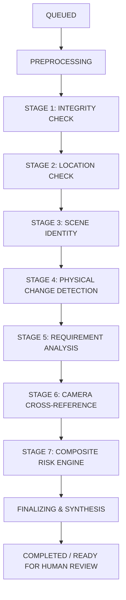

# Ground0 Verification AI Pipeline

## 1. Orchestrated Verification Pipeline Lifecycle

Ground0 does not rely on a monolithic AI prompt. Instead, it executes an **orchestrated multi-stage inspection pipeline** where specialized computer vision algorithms, forensic validators, and multimodal reasoning models run sequentially, feeding an aggregated risk engine.



---

## 2. Stage-by-Stage Forensic & Vision Specification

### Stage 1: Evidence Integrity Check
* **Objective**: Ensure the media is fresh, non-manipulated, and has not been recycled from prior work orders or external internet sources.
* **Forensic Algorithms**:
  1. **Cryptographic Hash (SHA-256)**: Exact byte comparison against all previous submissions in `evidence_hashes`. If matched:
     * *Verdict*: `DUPLICATE_EVIDENCE_DETECTED` (Never accusatory; flagged for human inspection).
  2. **Perceptual Hash (Difference Hash / pHash)**: 64-bit fingerprinting robust against minor compression artifacts, resizing, and color tweaks. If Hamming distance $D_H \le 6$ against historical submissions:
     * *Verdict*: `PERCEPTUAL_REUSE_DETECTED`.
  3. **Capture Session Nonce Validation**: Confirms the image payload embeds the single-use token issued in the current session.
* **Output**: `integrity_passed: bool`, `hash_conflict: bool`, `hamming_distance: int`.

### Stage 2: Location Consistency Check
* **Objective**: Verify that the captured evidence matches the physical coordinates mandated in the work order.
* **Algorithm**:
  - Computes the great-circle distance using the **Haversine formula**:
    $$d = 2r \arcsin\left(\sqrt{\sin^2\left(\frac{\Delta \phi}{2}\right) + \cos(\phi_1)\cos(\phi_2)\sin^2\left(\frac{\Delta \lambda}{2}\right)}\right)$$
  - Evaluates distance $d$ against the work order's tolerance radius $R_{tol}$ (default: 50.0 meters) augmented by the mobile device's GPS horizontal accuracy uncertainty $\sigma_{gps}$:
    $$\text{Effective Radius} = R_{tol} + \sigma_{gps}$$
* **Heuristics**:
  - $d \le R_{tol}$: `LOCATION_CONSISTENT` (Score: 1.0).
  - $R_{tol} < d \le 2 \times R_{tol}$: `LOCATION_MARGINAL` (Score: 0.6, triggers review flag).
  - $d > 2 \times R_{tol}$: `LOCATION_DISCREPANCY` (Score: 0.0, triggers high risk).
* **Output**: `location_verified: bool`, `distance_meters: float`, `confidence: float`.

### Stage 3: Scene Identity & Geometry Verification
* **Objective**: Confirm that the "Before" and "After" media depict the **exact same physical location** regardless of lighting, time of day, or minor angle shifts.
* **Computer Vision Stack**:
  1. **Foundation Model Embeddings (DINOv2 / SigLIP)**:
     - Extracts dense 384-d / 768-d patch tokens.
     - Computes cosine similarity across invariant background elements (buildings, curbs, fixed infrastructure, trees):
       $$S_{cosine} = \frac{\mathbf{u} \cdot \mathbf{v}}{\|\mathbf{u}\|_2 \|\mathbf{v}\|_2}$$
  2. **Feature Matching & Homography (OpenCV ORB/SIFT + RANSAC)**:
     - Extracts keypoints on rigid background structures.
     - Estimates the planar homography matrix $H$:
       $$\mathbf{x}' \sim H \mathbf{x}$$
     - Inlier ratio $> 0.35$ confirms static physical geometric alignment.
* **Output**: `scene_match_score: float` (0.0 to 1.0), `geometric_inliers: int`, `explanation: str`.

### Stage 4: Physical Change Detection
* **Objective**: Quantify the physical delta and verify whether defect removal or repair has physically occurred.
* **Supported Domains**:

#### A. Garbage Cleanup
- **Semantic Waste Segmentation**: Deep learning segmentation (e.g. Fine-tuned Mask R-CNN / SAM-family) detects waste polygons.
- **Coverage Metric**:
  $$\text{Waste Coverage} = \frac{\sum \text{Pixels}_{\text{waste}}}{\sum \text{Pixels}_{\text{ground\_plane}}} \times 100\%$$
- **Visual Reduction**:
  $$\text{Visual Reduction \%} = \frac{\text{Coverage}_{\text{before}} - \text{Coverage}_{\text{after}}}{\text{Coverage}_{\text{before}}} \times 100\%$$
- **Benchmark**: $> 85\%$ visual reduction marks successful clearing.

#### B. Pothole Repair
- **Road Defect Detection**: Evaluates cavity depth cues, asphalt disruption contours, and edge breaks.
- **Patch Continuity Analysis**:
  - Verifies presence of fresh asphalt patch overlaying the original defect polygon.
  - Checks surface planar continuity and road line restoration.
- **Benchmark**: Absence of cavity contour + homogeneous road surface texture marks successful repair.
* **Output**: `change_detected: bool`, `change_score: float`, `defect_reduction_pct: float`, `diff_mask_url: str`.

### Stage 5: Work-Order Requirement Verification (Gemini Multimodal Reasoning)
* **Objective**: Bridge natural language legal/contractual mandates with visual evidence.
* **Workflow**:
  - Ingests structured work order requirements:
    ```json
    {
      "task_type": "garbage_removal",
      "target_area": "sidewalk section adjacent to North Gate",
      "expected_state": "zero visible plastic or organic debris, clear walkway",
      "completion_threshold": 90.0
    }
    ```
  - Gemini 1.5/2.0 evaluates Before and After imagery in conjunction with the quantitative metrics from Stages 1–4.
  - Generates structured JSON explaining whether all specific contractual clauses were fulfilled.
* **Output**: `requirement_satisfied: bool`, `confidence: float`, `explanation: str`.

### Stage 6: Camera Evidence Cross-Reference
* **Objective**: Corroborate worker-submitted media with independent, organization-owned CCTV / ONVIF streams if a camera covers the site bounding box.
* **Process**:
  - Queries `cameras` covering the site coordinates.
  - Samples video frames across the worker's active work session window.
  - Performs background subtraction and movement verification (confirming crew activity on-site).
* **Output**: `camera_evidence_available: bool`, `activity_confirmed: bool`, `camera_match_confidence: float`.

### Stage 7: Composite Risk Assessment Engine
* **Objective**: Synthesize all upstream pipeline metrics into an actionable risk classification for the human inspector.
* **Risk Score Formulation**:
  $$R_{composite} = w_1 (1 - S_{integrity}) + w_2 (1 - S_{loc}) + w_3 (1 - S_{scene}) + w_4 (1 - S_{change}) + w_5 (1 - S_{req})$$
  - Default weights: $w_1 = 0.30, w_2 = 0.20, w_3 = 0.25, w_4 = 0.15, w_5 = 0.10$.
* **Risk Classifications**:
  - $R_{composite} < 0.15$: **LOW RISK** ➔ `READY_FOR_HUMAN_REVIEW`
  - $0.15 \le R_{composite} < 0.40$: **MEDIUM RISK** ➔ `HUMAN_REVIEW_RECOMMENDED`
  - $R_{composite} \ge 0.40$: **HIGH RISK** ➔ `FLAG_FOR_AUDIT` / `MORE_EVIDENCE_REQUIRED`

---

## 3. Inspector Briefing Synthesis

The pipeline concludes by generating a comprehensive, non-accusatory briefing:

```json
{
  "verification_run_id": "8f8b030b-3398-4d5c-9c76-d18fc20623a9",
  "work_order_id": "WO-2091",
  "summary": {
    "location_status": "VERIFIED (14m from target, within 50m tolerance)",
    "integrity_status": "PASSED (Fresh capture session, no replay)",
    "scene_identity": "94.2% match (ORB inliers: 142 points)",
    "physical_change": "89.4% waste reduction (Coverage: 38% -> 4%)",
    "requirement_status": "SATISFIED",
    "cctv_corroboration": "ACTIVITY CONFIRMED",
    "risk_level": "LOW",
    "recommendation": "READY FOR HUMAN REVIEW"
  },
  "visual_artifacts": {
    "before_url": "https://storage.ground0.local/evidence/before_2091.jpg",
    "after_url": "https://storage.ground0.local/evidence/after_2091.jpg",
    "diff_mask_url": "https://storage.ground0.local/artifacts/diff_2091.png"
  }
}
```
