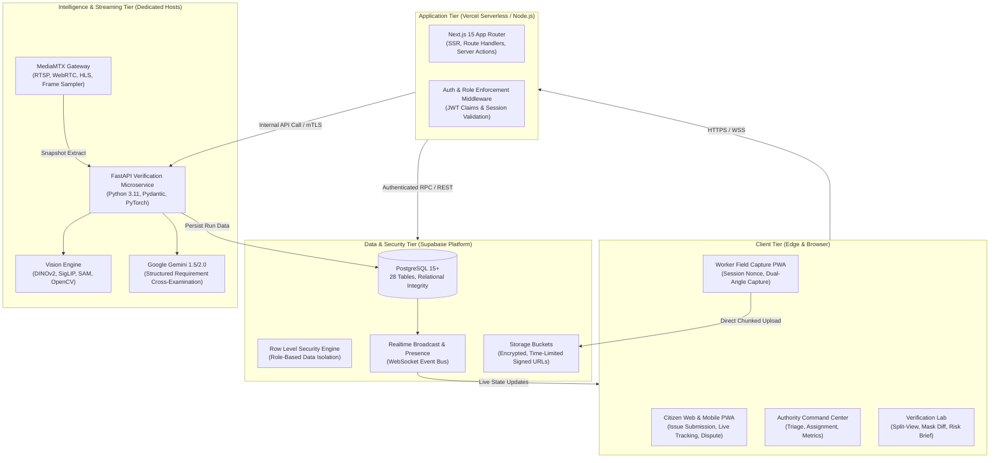
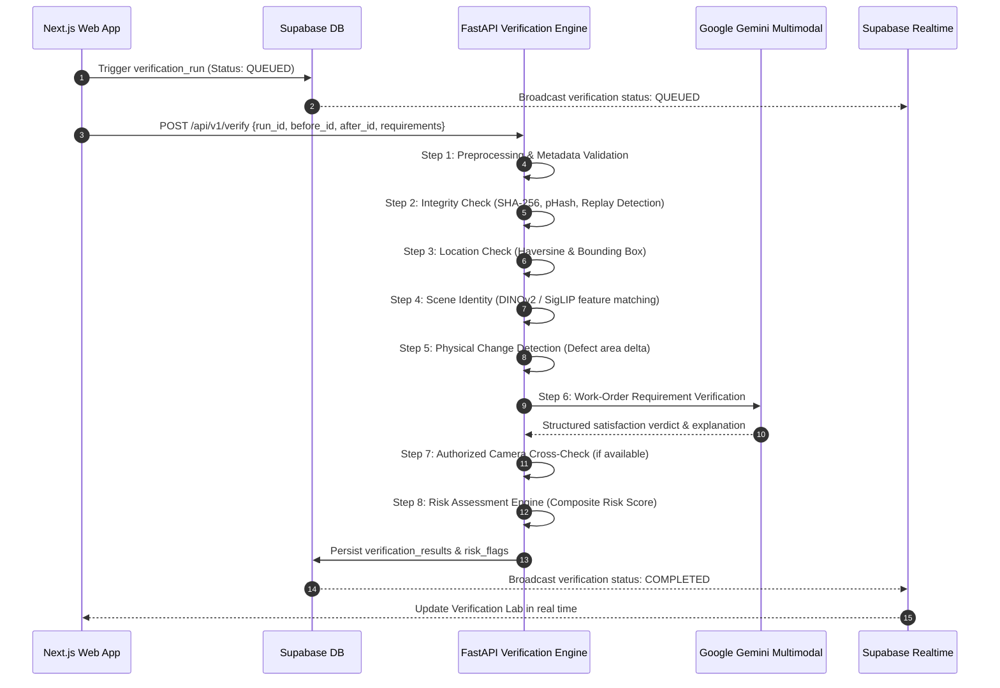

# Ground0 Technical Architecture

## 1. Architectural Philosophy

Ground0 is engineered to eliminate the trust deficit in municipal public works and infrastructure maintenance. Traditional systems fail because they treat photos as static claims rather than evidentiary artifacts. 

Ground0 enforces an **Evidence-First Verification Architecture** where every claim must pass through an automated forensic, geospatial, and visual inspection pipeline before being presented to human authorities.

---

## 2. High-Level Component Topology



---

## 3. Monorepo Structural Blueprint

Ground0 is organized as a clean, modular monorepo:

```
ground0/
├── apps/
│   ├── web/                     # Next.js 15 App Router Frontend & PWA
│   │   ├── app/                 # All routes (/report, /work-orders, /verification-lab, etc.)
│   │   ├── components/          # Reusable Royal Obsidian UI, 3D Canvas, Maps
│   │   ├── hooks/               # Custom React hooks (useGeolocation, useVerificationStream)
│   │   ├── lib/                 # Supabase client, auth helpers, API clients
│   │   └── public/              # Icons, PWA manifest, static assets
│   └── ai-service/              # FastAPI Computer Vision & Verification Service
│       ├── app/
│       │   ├── api/             # API Route handlers (/v1/verify, /v1/integrity, /v1/scene)
│       │   ├── core/            # Configuration, logging, security middleware
│       │   ├── models/          # PyTorch model loaders & embeddings (DINOv2, SigLIP)
│       │   ├── pipelines/       # 10-stage verification pipeline orchestrator
│       │   └── schemas/         # Pydantic input/output schemas
│       ├── Dockerfile
│       └── requirements.txt
├── services/
│   └── media-gateway/           # MediaMTX configuration & stream relay
│       ├── mediamtx.yml         # RTSP/WebRTC streamer configuration
│       └── docker-compose.yml
├── packages/
│   ├── ui/                      # Shared UI components & design system tokens
│   ├── types/                   # Shared TypeScript interfaces (Database models, Enums)
│   └── config/                  # Shared ESLint, Prettier, and TypeScript configurations
├── supabase/
│   ├── migrations/              # Production-grade SQL migrations with RLS policies
│   └── seed/                    # Baseline test data (organizations, sample sites)
├── docs/                        # Complete technical and operational documentation
├── tests/                       # Automated unit, integration, and E2E test suites
└── .env.example                 # Environment configuration template
```

---

## 4. End-to-End Workflow & Data Lifecycle

### Phase A: Citizen Intake & Deduplication
1. Citizen opens the `/report` interface on any device.
2. Captures an image/video of the issue, records GPS coordinates with horizontal accuracy radius, and provides description.
3. Next.js Route Handler validates payload with Zod.
4. Gemini extracts structured issue data: category, estimated severity, confidence, and recommended municipal department.
5. **Deduplication Engine**:
   - Queries existing open complaints within a 75-meter spatial radius.
   - Computes visual similarity against recent active issues.
   - If a match is detected above threshold (>0.85 similarity), links the complaint to an existing `master_issues` cluster and increments urgency counter.
   - If novel, instantiates a new `master_issues` record and assigns a human-readable identifier (e.g., `GR0-2941`).

### Phase B: Authority Work Order Formulation
1. Municipal authority inspects pending master issues on the `/dashboard`.
2. Authority accepts the report and generates a formal `work_orders` contract (`WO-2091`).
3. Contract specifies:
   - Target geospatial bounding box and site ID.
   - Strict work completion requirements (e.g. *Total waste area reduction > 90%*).
   - Mandatory capture challenges (Front, Left, Right angles + 5s video).
   - Assigned field contractor or municipal crew.

### Phase C: Field Execution & Anti-Replay Evidence Capture
1. Field worker logs in via the Field Worker PWA (`/capture/[id]`).
2. **Before-Work Session**:
   - Requests a cryptographically fresh `capture_session_id` from the server.
   - Server issues a single-use time-bound nonce (valid for 5 minutes).
   - Worker takes "Before" photo with active device gyroscope and GPS metadata.
   - Client calculates SHA-256 hash before uploading directly to Supabase Storage private bucket `evidence-original` via signed upload URL.
3. Worker taps **"Start Work"**; status transitions to `IN_PROGRESS`.
4. After physical work completes, worker taps **"Complete Work"**.
5. Server generates a new nonce and capture challenge specifying required perspective angles. Worker submits "After" evidence.

### Phase D: Automated AI Verification Pipeline
The verification orchestrator executes asynchronously in the FastAPI AI service:



### Phase E: Human Inspection & Transparent Resolution
1. Official municipal inspector opens the `/verification-lab` for the completed work order.
2. Lab presents:
   - **Interactive Split Slider**: High-resolution Before vs After with synchronized zoom.
   - **Difference / Mask View**: Highlighted defect regions and verified removal areas.
   - **Forensic Breakdown**: Integrity check verdict, scene match confidence (e.g., 94%), physical change percentage (e.g., 91% reduction).
   - **AI Risk Assessment**: Low, Medium, or High Risk with granular explanation tags.
3. Inspector takes formal action: **Approve**, **Reject**, or **Request Additional Evidence**.
4. Upon approval, complaint status transitions to `RESOLVED`.
5. Citizen receives real-time notification with Before ↔ After comparison and confirms satisfaction or requests reopening with new evidence.

---

## 5. Security & Isolation Boundaries

- **Browser Boundary**: Public clients only have access to `anon` Supabase keys. All private keys (`SUPABASE_SECRET_KEY`, `GEMINI_API_KEY`, internal API keys) are strictly confined to backend execution environments.
- **Storage Isolation**: Evidence files are stored in private Supabase Storage buckets. Access is granted exclusively via short-lived (15-minute) cryptographic signed URLs generated server-side.
- **Microservice Isolation**: The FastAPI verification service and MediaMTX gateway communicate with the Next.js server via authenticated bearer tokens (`AI_SERVICE_INTERNAL_KEY`) and strict IP firewalling.
- **Row Level Security (RLS)**: Enforced directly at the PostgreSQL layer ensuring zero cross-tenant data leakage between organizations, contractors, and citizens.
