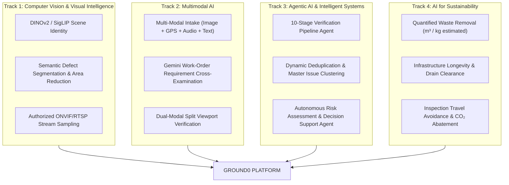

# Competition Criteria & Evaluation Alignment Matrix

## 1. Overview of Evaluated Competition Documents

An automated analysis of the competition documents was conducted:
1. **Document 1 (`1iEssnKaAasNl2VOUCf0fUQ66cBsTZmnyT2NT24fIjFo`)**: Theme: *Computer Vision & Visual Intelligence*
2. **Document 2 (`18AlksTM9jvbjzdgMMSnTDJbkcftkorLJOe9NiY0kwyk`)**: Theme: *Multimodal AI*
3. **Document 3 (`1yH4_2DxM3LX2jPlrnoLajhAejBDCSZ_8O0sqirq4CgY`)**: Theme: *Agentic AI & Intelligent Systems*
4. **Document 4 (`1qIw9Ups_aFOCVrLJp0Pu9l5Q2MJp30DwJ3tNEJi55nI`)**: Theme: *AI for Sustainability*

All documents follow a unified challenge structure designed to address real-world operational bottlenecks through cutting-edge AI paradigms.

---

## 2. Core Themes & Challenge Statements

| Document | Theme | Scenario-Based Challenge | Key Technical Mandate |
| :--- | :--- | :--- | :--- |
| **Doc 1** | **Computer Vision & Visual Intelligence** | Manual inspection of images, videos, or camera feeds leads to slow decisions, missed anomalies, and inconsistent outcomes. | Automate visual understanding, detect patterns/anomalies (defects, changes, scene identification), and deliver actionable operational insights. |
| **Doc 2** | **Multimodal AI** | Disconnected data across text, images, videos, audio, and documents fragments workflows and slows cross-modal decision making. | Combine text, images, video, and audio to provide intelligent search, contextual understanding, knowledge extraction, and cross-modal reasoning. |
| **Doc 3** | **Agentic AI & Intelligent Systems** | Repetitive decision-making, fragmented workflows, and manual coordination across systems create delays and errors. | Build an autonomous Agentic AI that plans, reasons, collaborates across multi-step pipelines, and executes complex tasks with minimal human intervention. |
| **Doc 4** | **AI for Sustainability** | Difficulty monitoring environmental impact, optimizing resource usage, reducing waste, and making sustainable decisions due to fragmented data. | Promote responsible resource utilization, reduce waste, improve operational efficiency, and quantify sustainability impact with verified proof. |

---

## 3. Submission Requirements Matrix

All tracks uniformly mandate the following core deliverables:

1. **Problem Statement**: Clear definition of the real-world operational friction point.
2. **Solution Description**: Comprehensive architectural and algorithmic overview showing how AI is deeply integrated into operational workflows.
3. **GitHub Repository**: Complete frontend and backend source code with a production-grade `README.md` covering setup, architecture, and step-by-step reproduction.
4. **Deployed Application Link**: A publicly accessible, fully interactive deployment.
5. **Demo Video**: High-impact 3–5 minute demonstration video demonstrating end-to-end functionality, agent workflows, and computer vision verification in action.

---

## 4. Ground0 Multi-Track Strategic Convergence

Ground0 is designed not merely to address a single track, but to act as a **flagship multi-track convergence** covering all 4 domains simultaneously:

### Deep Track-by-Track Justification

1. **Computer Vision & Visual Intelligence**:
   - Rather than simple static image classification, Ground0 performs **spatiotemporal physical change verification**. It verifies whether Before and After imagery match geometric planes (homography/ORB), computes perceptual hashes (pHash) to detect replay attacks, and calculates pixel-level area reduction masks (e.g. 87% waste coverage reduction).
2. **Multimodal AI**:
   - Citizen complaints fuse visual evidence, precise GPS, natural language descriptions, and voice notes. Gemini 1.5/2.0 extracts structured requirements from contract legal text and correlates them against visual change parameters and environmental telemetry.
3. **Agentic AI & Intelligent Systems**:
   - The Ground0 Verification Engine operates as an autonomous agent pipeline (`Integrity` ➔ `Location` ➔ `Scene` ➔ `Change` ➔ `Requirement` ➔ `Camera` ➔ `Risk`). The agent gathers evidence, runs specialized sub-evaluations, dynamically computes anomaly confidence, and synthesizes a structured inspection brief for the human auditor.
4. **AI for Sustainability**:
   - Ground0 provides an automated **Environmental Impact Ledger** tracking physical waste removed, potholes repaired before structural road failure occurs, and carbon emissions abated by eliminating unnecessary physical municipal dispatch trips. Every metric is categorized as `MEASURED`, `REPORTED`, or `ESTIMATED`.

---

## 5. Technical Stack Conformance Checklist

| Layer | Requirement | Ground0 Architecture | Status |
| :--- | :--- | :--- | :---: |
| **Frontend Framework** | React.js / Vite / Next.js | Next.js 15 (React 19), App Router, Tailwind CSS, shadcn/ui | **Compliant** |
| **UI & 3D Styling** | Tailwind CSS / UI Framework | Tailwind CSS, Three.js, React Three Fiber, Framer Motion | **Compliant** |
| **Backend Framework** | Node.js / Express or Python / FastAPI | FastAPI (Python 3.11) + Next.js Server Actions / Route Handlers | **Compliant** |
| **Authentication** | JWT / bcrypt / Supabase Auth | Supabase Auth (JWT with JWKS cryptographic signature verification) | **Compliant** |
| **Validation** | Zod / Pydantic | Zod (Frontend/Next.js) + Pydantic v2 (FastAPI AI service) | **Compliant** |
| **Database** | Supabase PostgreSQL | Supabase PostgreSQL with 28+ relational tables and strict RLS | **Compliant** |
| **AI Integration** | Google Gemini / Vision AI | Google Gemini 1.5/2.0 Flash + PyTorch CV (DINOv2, SigLIP, SAM) | **Compliant** |
| **Key Security** | Server-side API key isolation | Zero browser exposure of Gemini/Supabase Secret keys | **Compliant** |
| **Deployment** | Vercel (Web) + Render/Fly (Backend) | Next.js on Vercel; FastAPI CV & MediaMTX on dedicated hosts | **Compliant** |
| **Testing** | API Testing (Postman/Bruno/Pytest) | Automated Pytest CV suite + Vitest Next.js integration tests | **Compliant** |

---

## 6. Hackathon Scoring Maximization Strategy

- **Innovation & Originality (25%)**: Solving the "proof of physical work" problem with cryptographically nonced capture and scene matching instead of naive single-photo classification.
- **Technical Rigor & Architecture (25%)**: Enterprise-grade monorepo, strict Row Level Security (RLS), anti-replay hashing, camera SSRF airgaps, and seamless microservices.
- **Completeness & Working End-to-End Demo (25%)**: Full round-trip workflow from citizen report to worker capture, AI agent verification, inspector approval, and citizen before/after resolution.
- **User Experience & Presentation (25%)**: "Royal Obsidian" design language, interactive dual-slider verification lab, real-time map telemetry, and immersive 3D command center visualization.
