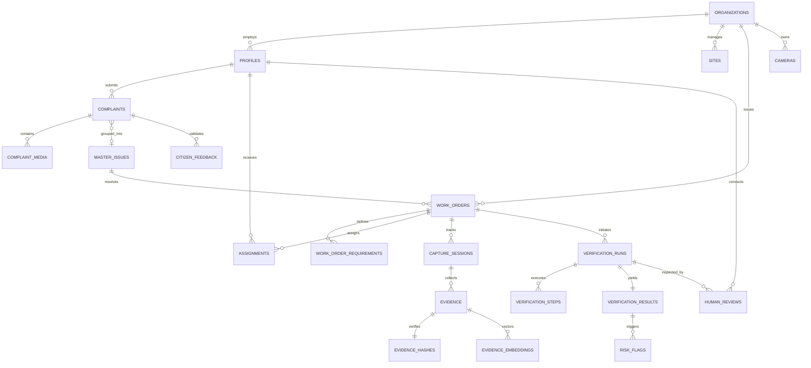

# Ground0 Database Architecture & Schema Specification

## 1. Overview & Principles

The Ground0 data persistence tier is built on **Supabase PostgreSQL 15+** with **Row Level Security (RLS)** strictly enforced on every table. The database adheres to the following principles:

1. **UUIDv4 Primary Keys**: All entities use universally unique identifiers to prevent enumeration attacks and support distributed generation.
2. **Explicit Foreign Key Constraints**: Referential integrity is enforced with cascading or restricting behavior appropriate to evidentiary standards.
3. **Full Auditability**: Crucial records (evidence, verification runs, review actions) are append-only or version-tracked with automatic timestamps (`created_at`, `updated_at`).
4. **Geospatial Readiness**: Spatial coordinates (`latitude`, `longitude`) are indexed with PostGIS / B-Tree spatial indexes for ultra-fast radius clustering.
5. **Zero Trust Isolation**: Multi-tenant isolation between municipalities and contractor organizations is enforced at the database engine level via RLS policies.

---

## 2. Entity Relationship Diagram

---

## 3. Schema Definitions: Core 29 Tables

### Identity & Organizations
1. **`profiles`**: User identities extending `auth.users`.
   - `id` (UUID, PK, FK to `auth.users`)
   - `role` (`CITIZEN`, `FIELD_WORKER`, `CONTRACTOR`, `INSPECTOR`, `PROJECT_MANAGER`, `ORGANIZATION_ADMIN`, `AUDITOR`, `SUPER_ADMIN`)
   - `full_name` (TEXT), `phone` (TEXT), `avatar_url` (TEXT)
   - `organization_id` (UUID, FK to `organizations`, NULLABLE for citizens)
   - `created_at`, `updated_at` (TIMESTAMPTZ)

2. **`organizations`**: Municipalities, public works departments, and contractor firms.
   - `id` (UUID, PK), `name` (TEXT), `slug` (TEXT, UNIQUE), `org_type` (MUNICIPALITY, CONTRACTOR, AUDITOR)
   - `settings` (JSONB), `created_at`, `updated_at` (TIMESTAMPTZ)

3. **`organization_members`**: Membership mapping supporting multi-tenant roles.
   - `id` (UUID, PK), `organization_id` (UUID, FK), `user_id` (UUID, FK), `role` (TEXT)
   - `created_at` (TIMESTAMPTZ)

### Infrastructure & Sites
4. **`sites`**: Designated physical zones, municipal wards, or road sectors.
   - `id` (UUID, PK), `organization_id` (UUID, FK), `name` (TEXT), `zone_code` (TEXT)
   - `latitude` (NUMERIC), `longitude` (NUMERIC), `boundary_geojson` (JSONB)
   - `created_at` (TIMESTAMPTZ)

5. **`assets`**: Specific physical assets (streetlights, storm drains, bridges, roads).
   - `id` (UUID, PK), `site_id` (UUID, FK), `asset_type` (TEXT), `identifier` (TEXT)
   - `metadata` (JSONB), `created_at` (TIMESTAMPTZ)

6. **`projects`**: High-level public works initiatives grouping multiple work orders.
   - `id` (UUID, PK), `organization_id` (UUID, FK), `title` (TEXT), `budget` (NUMERIC)
   - `status` (TEXT), `start_date` (DATE), `end_date` (DATE)

### Complaints & Intake
7. **`complaints`**: Citizen-reported issues.
   - `id` (UUID, PK), `public_id` (TEXT, UNIQUE, e.g. `GR0-2941`), `citizen_id` (UUID, FK `profiles`)
   - `title` (TEXT), `description` (TEXT), `category` (pothole, garbage, drain_blockage, etc.)
   - `latitude` (NUMERIC), `longitude` (NUMERIC), `location_accuracy_m` (NUMERIC), `address_text` (TEXT)
   - `status` (`SUBMITTED`, `UNDER_REVIEW`, `ACCEPTED`, `WORK_ASSIGNED`, `IN_PROGRESS`, `VERIFYING`, `INSPECTOR_REVIEW`, `RESOLVED`, `REOPENED`)
   - `ai_classification` (JSONB), `priority` (`LOW`, `MEDIUM`, `HIGH`, `CRITICAL`)
   - `created_at`, `updated_at` (TIMESTAMPTZ)

8. **`complaint_media`**: Media attachments for complaints.
   - `id` (UUID, PK), `complaint_id` (UUID, FK), `media_type` (IMAGE, VIDEO, AUDIO)
   - `storage_path` (TEXT), `sha256_hash` (TEXT), `created_at` (TIMESTAMPTZ)

9. **`master_issues`**: Consolidated clusters of duplicate complaints.
   - `id` (UUID, PK), `public_id` (TEXT, UNIQUE, e.g. `GR0-M42`), `organization_id` (UUID, FK)
   - `title` (TEXT), `category` (TEXT), `latitude` (NUMERIC), `longitude` (NUMERIC)
   - `status` (TEXT), `priority` (TEXT), `complaint_count` (INTEGER DEFAULT 1)
   - `created_at`, `updated_at` (TIMESTAMPTZ)

10. **`complaint_issue_links`**: Many-to-one junction between complaints and master issues.
    - `id` (UUID, PK), `complaint_id` (UUID, FK), `master_issue_id` (UUID, FK), `match_confidence` (NUMERIC)
    - `linked_at` (TIMESTAMPTZ)

### Work Orders & Assignments
11. **`work_orders`**: Formal work contracts issued to crews.
    - `id` (UUID, PK), `public_id` (TEXT, UNIQUE, e.g. `WO-2091`), `organization_id` (UUID, FK)
    - `master_issue_id` (UUID, FK, NULLABLE), `site_id` (UUID, FK, NULLABLE)
    - `title` (TEXT), `description` (TEXT), `issue_type` (TEXT), `priority` (TEXT)
    - `latitude` (NUMERIC), `longitude` (NUMERIC), `tolerance_radius_m` (NUMERIC DEFAULT 50.0)
    - `assigned_contractor_id` (UUID, FK `organizations`, NULLABLE)
    - `assigned_worker_id` (UUID, FK `profiles`, NULLABLE)
    - `status` (`DRAFT`, `ASSIGNED`, `IN_PROGRESS`, `COMPLETED_PENDING_VERIFICATION`, `VERIFIED`, `REJECTED`, `CLOSED`)
    - `deadline` (TIMESTAMPTZ), `camera_verification_enabled` (BOOLEAN DEFAULT FALSE)
    - `created_at`, `updated_at` (TIMESTAMPTZ)

12. **`work_order_requirements`**: Structured, quantifiable completion criteria.
    - `id` (UUID, PK), `work_order_id` (UUID, FK), `task_type` (TEXT), `target_area` (TEXT)
    - `expected_state` (TEXT), `required_evidence_angles` (JSONB)
    - `completion_threshold_pct` (NUMERIC), `created_at` (TIMESTAMPTZ)

13. **`assignments`**: Crew assignment history and audit trail.
    - `id` (UUID, PK), `work_order_id` (UUID, FK), `assignee_id` (UUID, FK `profiles`)
    - `assigned_by` (UUID, FK `profiles`), `status` (ACTIVE, REASSIGNED, COMPLETED)
    - `assigned_at` (TIMESTAMPTZ)

### Evidence & Anti-Replay
14. **`capture_sessions`**: Time-bound, cryptographically challenged sessions.
    - `id` (UUID, PK), `work_order_id` (UUID, FK), `worker_id` (UUID, FK `profiles`)
    - `session_type` (`BEFORE_WORK`, `AFTER_WORK`), `server_nonce` (TEXT, UNIQUE)
    - `status` (`ACTIVE`, `SUBMITTED`, `EXPIRED`), `expires_at` (TIMESTAMPTZ)
    - `created_at` (TIMESTAMPTZ)

15. **`evidence`**: Individual captured photos, videos, or sensor logs.
    - `id` (UUID, PK), `capture_session_id` (UUID, FK), `work_order_id` (UUID, FK)
    - `evidence_type` (`BEFORE`, `AFTER`, `IN_PROGRESS`), `media_type` (IMAGE, VIDEO)
    - `storage_path` (TEXT), `latitude` (NUMERIC), `longitude` (NUMERIC), `altitude_m` (NUMERIC)
    - `device_heading_deg` (NUMERIC), `captured_at` (TIMESTAMPTZ), `created_at` (TIMESTAMPTZ)

16. **`evidence_hashes`**: Forensic integrity footprints.
    - `id` (UUID, PK), `evidence_id` (UUID, FK, UNIQUE), `sha256` (TEXT, INDEXED)
    - `phash` (TEXT, INDEXED), `file_size_bytes` (BIGINT), `mime_type` (TEXT)
    - `created_at` (TIMESTAMPTZ)

17. **`evidence_embeddings`**: Visual vectors for semantic similarity and deduplication.
    - `id` (UUID, PK), `evidence_id` (UUID, FK, UNIQUE), `model_name` (TEXT, e.g. `dinov2_vits14`)
    - `embedding` (VECTOR(384) or JSONB), `created_at` (TIMESTAMPTZ)

### Verification Pipeline & Intelligence
18. **`verification_runs`**: Executed verification pipeline instances.
    - `id` (UUID, PK), `work_order_id` (UUID, FK), `before_evidence_id` (UUID, FK `evidence`)
    - `after_evidence_id` (UUID, FK `evidence`), `status` (`QUEUED`, `PROCESSING`, `COMPLETED`, `FAILED`)
    - `triggered_by` (UUID, FK `profiles`), `started_at` (TIMESTAMPTZ), `completed_at` (TIMESTAMPTZ)

19. **`verification_steps`**: Granular execution trace of each pipeline stage.
    - `id` (UUID, PK), `verification_run_id` (UUID, FK), `step_name` (INTEGRITY, LOCATION, SCENE, CHANGE, REQUIREMENT, CAMERA, RISK)
    - `status` (`PENDING`, `RUNNING`, `PASSED`, `FAILED`, `WARNING`), `score` (NUMERIC)
    - `details` (JSONB), `execution_duration_ms` (INTEGER), `created_at` (TIMESTAMPTZ)

20. **`verification_results`**: Synthesized final score and AI recommendation.
    - `id` (UUID, PK), `verification_run_id` (UUID, FK, UNIQUE)
    - `location_verified` (BOOLEAN), `fresh_evidence_passed` (BOOLEAN), `duplicate_check_passed` (BOOLEAN)
    - `scene_match_score` (NUMERIC), `physical_change_score` (NUMERIC), `requirement_satisfied` (BOOLEAN)
    - `overall_risk_level` (`LOW`, `MEDIUM`, `HIGH`, `CRITICAL`)
    - `ai_recommendation` (`READY_FOR_HUMAN_REVIEW`, `FLAG_FOR_AUDIT`, `INSUFFICIENT_EVIDENCE`)
    - `explanation` (TEXT), `created_at` (TIMESTAMPTZ)

21. **`risk_flags`**: Specific warning flags raised during verification.
    - `id` (UUID, PK), `verification_run_id` (UUID, FK), `flag_code` (TEXT)
    - `severity` (`INFO`, `WARNING`, `CRITICAL`), `description` (TEXT), `created_at` (TIMESTAMPTZ)

### Cameras & Edge Media
22. **`cameras`**: Registered municipal and authorized IP cameras.
    - `id` (UUID, PK), `organization_id` (UUID, FK), `site_id` (UUID, FK, NULLABLE)
    - `name` (TEXT), `rtsp_stream_url_encrypted` (TEXT), `webrtc_stream_url` (TEXT)
    - `protocol` (`RTSP`, `ONVIF`, `WEBRTC`), `latitude` (NUMERIC), `longitude` (NUMERIC)
    - `status` (`ONLINE`, `OFFLINE`, `ERROR`), `last_heartbeat_at` (TIMESTAMPTZ)
    - `created_at`, `updated_at` (TIMESTAMPTZ)

23. **`camera_events`**: Periodic CV frame snapshots and activity detections.
    - `id` (UUID, PK), `camera_id` (UUID, FK), `event_type` (TEXT), `snapshot_storage_path` (TEXT)
    - `confidence` (NUMERIC), `detected_at` (TIMESTAMPTZ), `metadata` (JSONB)

### Reviews, Feedback & Operations
24. **`human_reviews`**: Final inspector actions and sign-offs.
    - `id` (UUID, PK), `verification_run_id` (UUID, FK), `work_order_id` (UUID, FK)
    - `reviewer_id` (UUID, FK `profiles`), `decision` (`APPROVED`, `REJECTED`, `MORE_EVIDENCE_REQUESTED`, `DISPATCH_PHYSICAL_INSPECTOR`)
    - `notes` (TEXT), `reviewed_at` (TIMESTAMPTZ)

25. **`citizen_feedback`**: Final citizen verification and dispute responses.
    - `id` (UUID, PK), `complaint_id` (UUID, FK), `citizen_id` (UUID, FK `profiles`)
    - `is_resolved` (BOOLEAN), `comments` (TEXT), `feedback_evidence_storage_path` (TEXT, NULLABLE)
    - `created_at` (TIMESTAMPTZ)

26. **`notifications`**: In-app notifications and real-time alerts.
    - `id` (UUID, PK), `user_id` (UUID, FK `profiles`), `title` (TEXT), `message` (TEXT)
    - `notification_type` (STATUS_CHANGE, VERIFICATION_COMPLETE, REVIEW_REQUIRED)
    - `reference_id` (UUID, NULLABLE), `is_read` (BOOLEAN DEFAULT FALSE), `created_at` (TIMESTAMPTZ)

27. **`environmental_metrics`**: Impact ledger for sustainability tracking.
    - `id` (UUID, PK), `work_order_id` (UUID, FK), `metric_type` (WASTE_REMOVED_KG, AREA_CLEANED_SQM, CO2_AVOIDED_KG)
    - `value` (NUMERIC), `data_source` (`MEASURED`, `REPORTED`, `ESTIMATED`)
    - `calculation_basis` (TEXT), `created_at` (TIMESTAMPTZ)

28. **`audit_events`**: Immutable append-only system audit log.
    - `id` (UUID, PK), `actor_id` (UUID, FK `profiles`, NULLABLE), `organization_id` (UUID, FK, NULLABLE)
    - `action` (TEXT), `resource_type` (TEXT), `resource_id` (UUID), `ip_address` (INET)
    - `payload_diff` (JSONB), `created_at` (TIMESTAMPTZ DEFAULT NOW())

29. **`integration_configs`**: External service configuration and webhook settings.
    - `id` (UUID, PK), `organization_id` (UUID, FK), `service_name` (TEXT)
    - `config` (JSONB), `is_active` (BOOLEAN DEFAULT TRUE), `created_at` (TIMESTAMPTZ)

---

## 4. Row Level Security (RLS) Policy Architecture

Every table operates under `ALTER TABLE ... ENABLE ROW LEVEL SECURITY;`. Access policies are strictly divided across functional roles:

| Table | Citizen | Field Worker | Inspector | Org Admin | Auditor |
| :--- | :--- | :--- | :--- | :--- | :--- |
| **`complaints`** | Read own, Create new | Read assigned issue links | Read organization complaints | Read/Write org complaints | Read-only org complaints |
| **`work_orders`** | Read associated with own issue | Read/Write assigned work orders | Read all org work orders | Full org management | Read-only |
| **`capture_sessions`** | None | Read/Write own active sessions | Read associated | Read org sessions | Read-only |
| **`evidence`** | Read approved after resolution | Read/Write assigned jobs | Read all verification evidence | Read all org evidence | Read-only |
| **`verification_runs`** | Read final verdict for own issue | Read results for assigned work orders | Full inspection access | Full org access | Read-only |
| **`human_reviews`** | Read final status | Read review notes on own job | Create reviews for assigned queue | Read/Manage reviews | Read-only |
| **`audit_events`** | None | None | None | Read org audit logs | Read org audit logs |

---

## 5. Storage Buckets & Access Controls

| Bucket Name | Visibility | Max Upload | MIME Whitelist | Retention / Access |
| :--- | :--- | :--- | :--- | :--- |
| **`complaint-media`** | Private | 25 MB | `image/*`, `video/mp4`, `audio/*` | Accessible via signed URLs by owner & authority |
| **`evidence-original`** | Private | 50 MB | `image/jpeg`, `image/png`, `video/mp4` | Restricted to worker capture & verification service |
| **`evidence-redacted`** | Private | 50 MB | `image/jpeg`, `image/png`, `video/mp4` | Face/plate blurred version for general inspection |
| **`verification-artifacts`** | Private | 10 MB | `image/png`, `application/json` | Difference masks, heatmaps, segmentation masks |
| **`camera-event-snapshots`** | Private | 10 MB | `image/jpeg` | Authorized CCTV sample frames |
| **`exports`** | Private | 100 MB | `application/pdf`, `text/csv` | Generated audit reports for auditors |
| **`avatars`** | Public | 2 MB | `image/jpeg`, `image/png`, `image/webp` | Public profile imagery |
