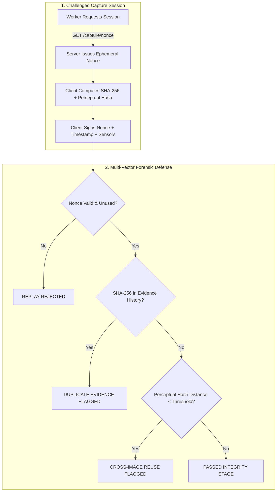

# Ground0 Security & Privacy Architecture

## 1. Zero Trust Evidence Model

In physical infrastructure verification, digital media is inherently susceptible to falsification:
- Re-uploading identical historic images (*Replay Attacks*).
- Capturing a different, pre-cleaned site (*Wrong-Site Submissions*).
- Altering EXIF timestamps and geotags (*Metadata Spoofing*).
- Generating synthetic or edited defect-free imagery (*AI / Photoshop Manipulation*).

Ground0 treats all client-submitted digital media with **Zero Trust**. No claim is accepted based solely on EXIF headers or single-party assertions.

---

## 2. Cryptographic Nonce & Freshness Protocol

1. **Session Initialization**: Prior to capturing Before or After evidence, the mobile client must call the Server Nonce Authority.
2. **Time-Bound Single-Use Nonce**: The server generates a cryptographically secure random token (e.g. 32 bytes base64) stored in `capture_sessions` with a strict **5-minute TTL**.
3. **Capture Envelope**: The mobile client incorporates the nonce into its capture envelope, computing the SHA-256 checksum across `(image_bytes + nonce + server_timestamp)`.
4. **Invalidation**: Once submitted or expired, the nonce is immediately marked `SUBMITTED` or `EXPIRED`. Any repeated submission with the same nonce is rejected.

---

## 3. Camera Gateway SSRF & Network Boundary Defense

IP cameras and CCTV streams introduce severe Server-Side Request Forgery (SSRF) and credential compromise risks if arbitrary URLs can be submitted to backend ingestion workers.

### SSRF Prevention Rules
1. **Administrative Privilege Only**: Camera stream endpoints can **only** be registered by verified `ORGANIZATION_ADMIN` roles.
2. **Protocol Whitelisting**: Strictly permit `rtsp://`, `rtsps://`, `http://`, `https://`. Disallow `file://`, `gopher://`, `ftp://`, or unexpected schemes.
3. **Loopback & Cloud Metadata Shielding**:
   - Explicitly block requests to `127.0.0.1`, `localhost`, `::1`.
   - Explicitly block cloud provider metadata endpoints (e.g., `169.254.169.254` AWS/GCP/Azure IMDS).
4. **Encrypted Credential Storage**: Camera passwords and authentication strings are encrypted with AES-GCM-256 using `CAMERA_ENCRYPTION_KEY` before persisting in PostgreSQL. Decryption occurs only in the isolated media-gateway proxy.
5. **No Open Relay**: MediaMTX re-streams only authorized endpoints, requiring internal bearer tokens (`MEDIA_GATEWAY_INTERNAL_TOKEN`) for access.

---

## 4. Privacy Engineering & Anonymization

Ground0 is designed for public infrastructure auditing—not civilian surveillance.

1. **Strictly No Facial Recognition**: The platform contains no biometric identification, face matching, or individual tracking algorithms.
2. **Automated Defacing / Blurring**:
   - All captured imagery and CCTV frame snapshots pass through an edge anonymization pipeline prior to rendering on public or citizen-facing portals.
   - Incidental human faces and vehicle license plates are detected via lightweight YOLO/OpenCV cascades and blurred using a 25-pixel Gaussian blur kernel.
3. **Dual-Bucket Storage Architecture**:
   - `evidence-original`: Confined exclusively to the automated CV verification service and authenticated human inspectors under explicit audit logging.
   - `evidence-redacted`: Available for citizen review and public transparency dashboards.

---

## 5. Row Level Security (RLS) & Multi-Tenant Boundaries

Security in Ground0 is enforced at the PostgreSQL database engine layer using Supabase Row Level Security.

### Policy Rules
- **No Shared Organization Visibility**: Organization A (e.g. City Public Works Department) has zero read or write access to Organization B's (e.g. County Highway Dept) work orders, contractors, or camera feeds.
- **Citizen Data Minimization**: Citizens can read only their own complaints and the public before/after resolution evidence. Personal contact details (phone, email) are shielded from contractors.
- **Field Worker Scoping**: Workers can view only work orders explicitly assigned to their user ID or their parent contractor organization.
- **Auditor Role**: Auditors possess read-only access to completed verification records, change logs, and `audit_events` without modification rights.

---

## 6. Prompt Injection Defense & AI Safety

Ground0 employs Large Multimodal Models (Google Gemini) for unstructured complaint extraction and work-order requirement analysis.

### Safeguards
1. **Structured Outputs Only**: All LLM calls require strict JSON schemas enforced via Pydantic models. Unstructured free-text is parsed into strongly typed attributes (`issue_type`, `severity`, `satisfaction_score`).
2. **Context Isolation**: Citizen-provided text is wrapped in defensive delimiters (e.g., `<user_description>...</user_description>`) with explicit system instructions to treat enclosed content as untrusted input.
3. **Non-Consequential Execution**:
   - The LLM **never** directly triggers payments, contractor fines, or official approvals.
   - The LLM produces a recommendation (`READY_FOR_HUMAN_REVIEW` or `FLAG_FOR_AUDIT`) which serves strictly as decision support for an authorized human inspector.

---

## 7. Storage Security & File Upload Hardening

1. **Signed URLs**: All evidence buckets are completely private. Direct public access is disabled. Files are accessed via temporary signed URLs with 15-minute expirations.
2. **Magic Byte Verification**: File uploads validate actual binary signatures (magic bytes) to ensure file extensions match MIME types (e.g., verifying `FF D8 FF` for JPEG), preventing disguised executable payloads.
3. **Upload Size Quotas**: Uploads are capped (Images: 25 MB; Videos: 50 MB) to prevent denial-of-service via resource exhaustion.

---

## 8. Immutable Audit Trail

Every state change in Ground0 generates an append-only record in `audit_events`:
- **Actor ID** (User UUID)
- **Organization ID**
- **Action** (e.g. `WORK_ORDER_CREATED`, `EVIDENCE_SUBMITTED`, `VERIFICATION_RUN_COMPLETED`, `INSPECTOR_APPROVED`)
- **IP Address & User Agent**
- **JSON Payload Diff**: Exact before-and-after state snapshot.

The `audit_events` table contains no `UPDATE` or `DELETE` policies, guaranteeing non-repudiation.
